# System Architecture Documentation

## Table of Contents

1. [System Overview](#system-overview)
2. [Component Architecture](#component-architecture)
3. [Data Flow](#data-flow)
4. [Agent Architecture](#agent-architecture)
5. [Infrastructure Design](#infrastructure-design)
6. [Security Architecture](#security-architecture)
7. [Deployment Architecture](#deployment-architecture)

## System Overview

### High-Level System Architecture

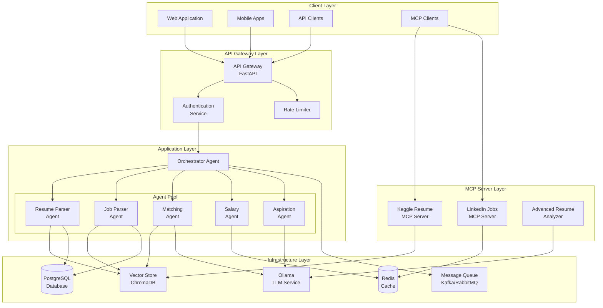

## Component Architecture

### Clean Architecture Layers

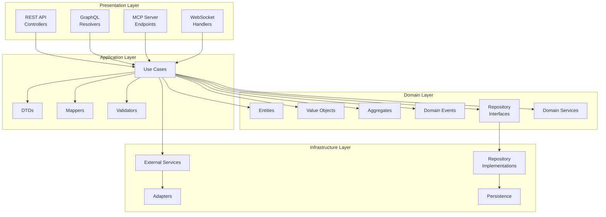

### Component Interaction Diagram

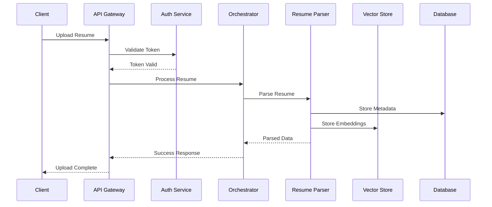

## Data Flow

### Resume Processing Flow

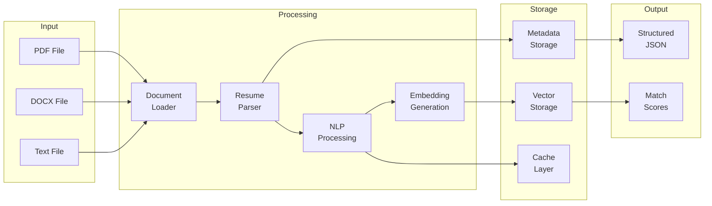

### Matching Algorithm Flow

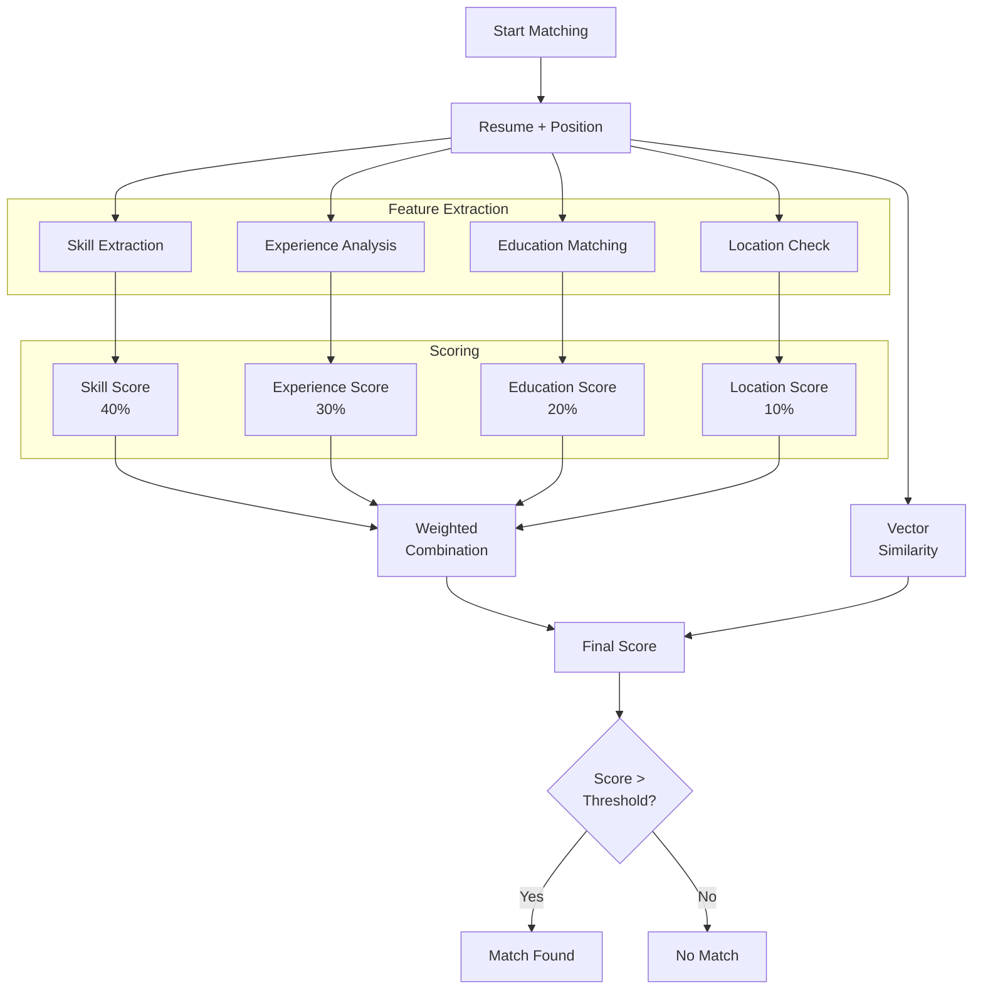

## Agent Architecture

### Multi-Agent System Design

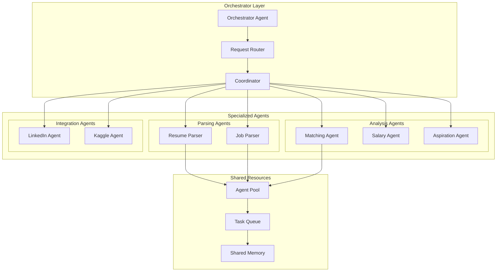

### Agent Communication Protocol

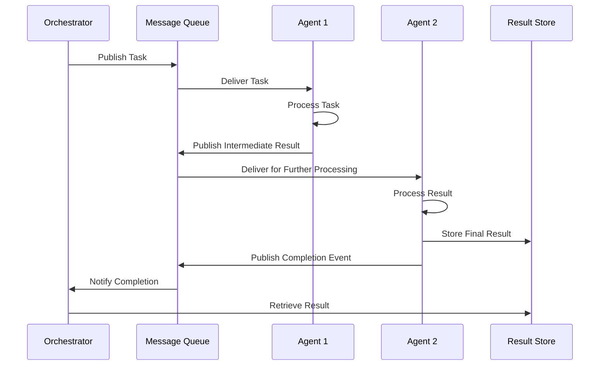

## Infrastructure Design

### Database Schema

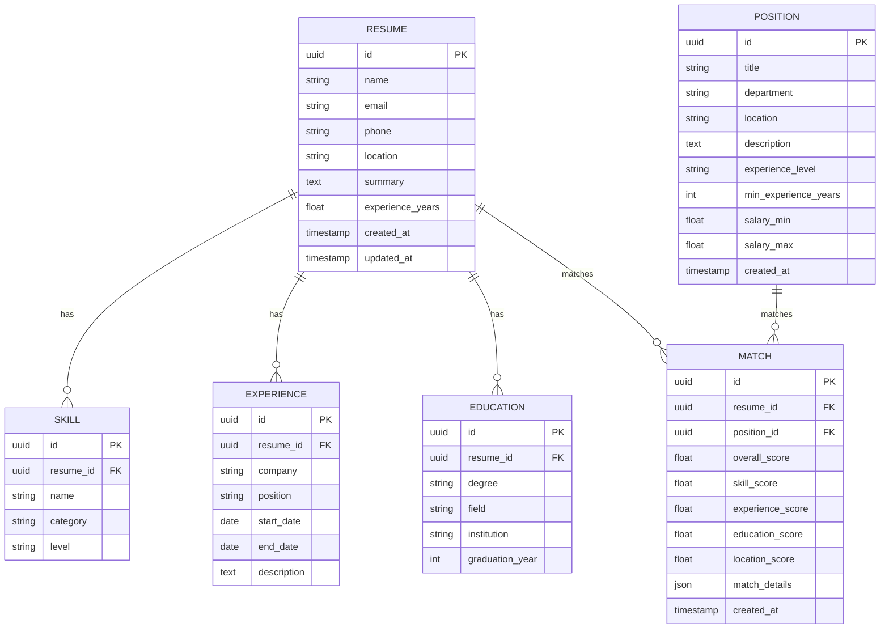

### Caching Strategy

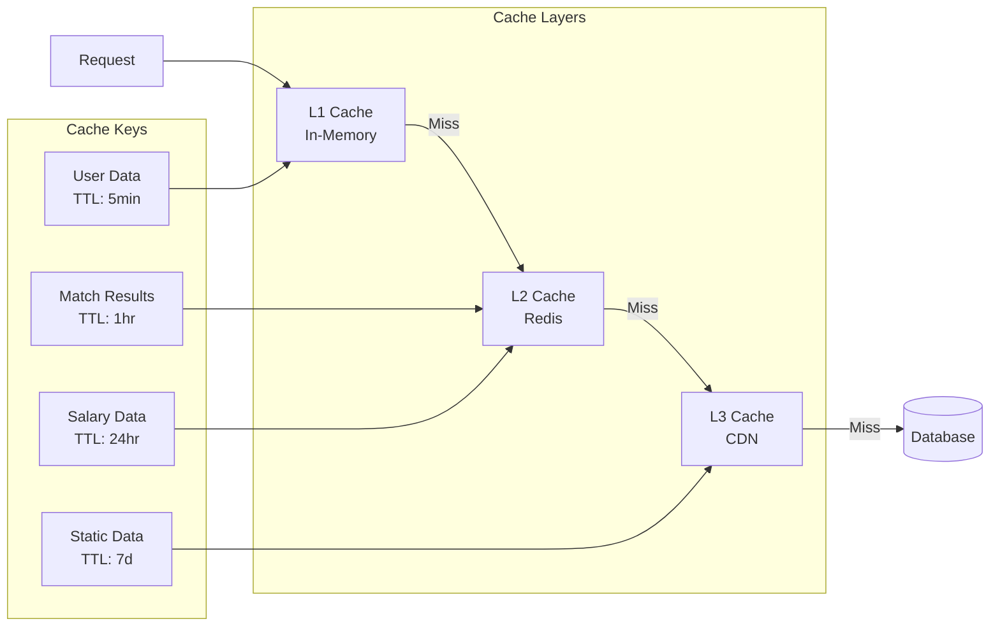

## Security Architecture

### Security Layers

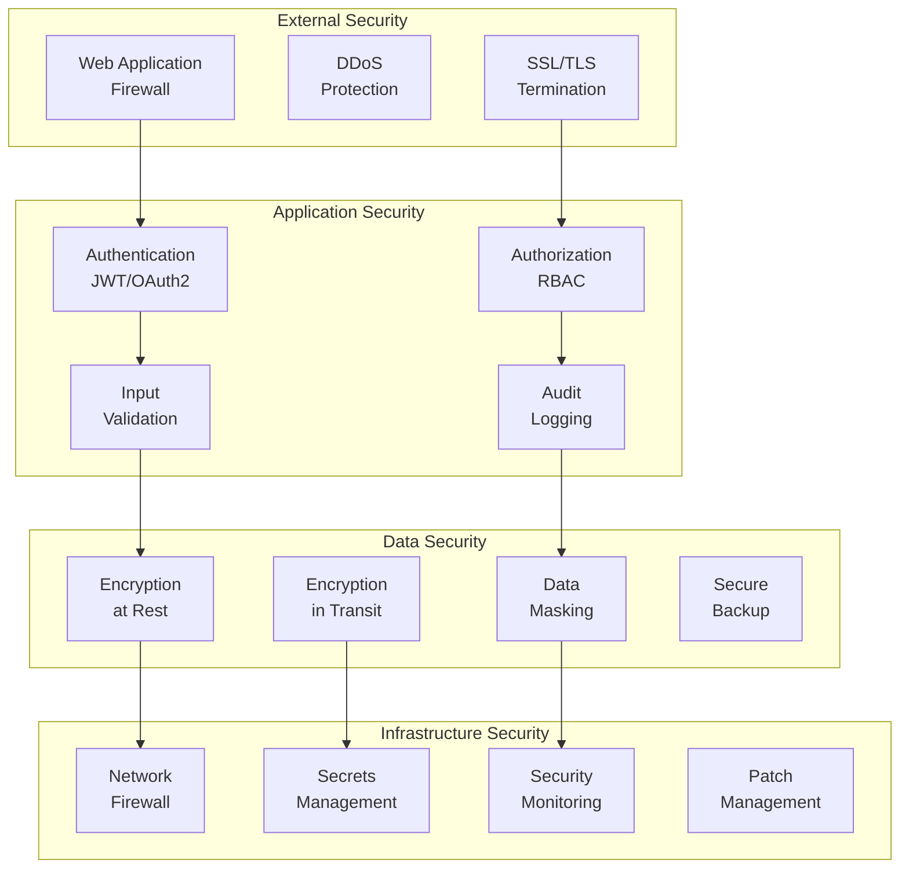

### Authentication Flow

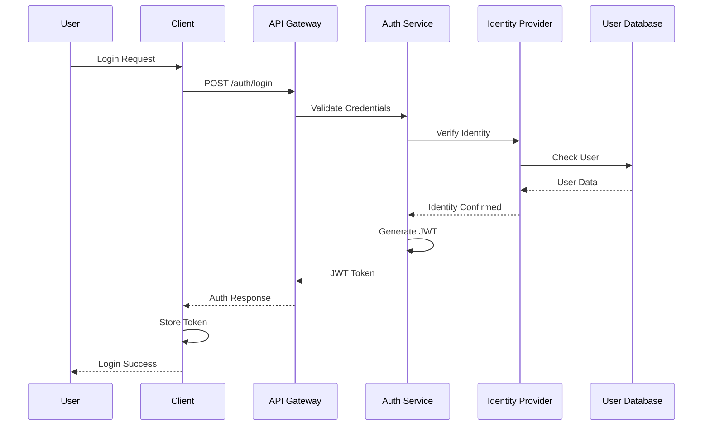

## Deployment Architecture

### Kubernetes Deployment

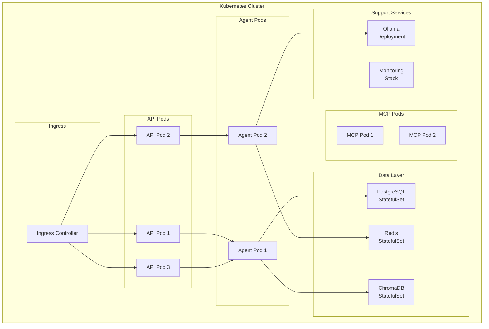

### CI/CD Pipeline

```mermaid
flowchart LR
    subgraph "Development"
        DEV[Developer]
        LOCAL[Local Testing]
    end
    
    subgraph "Source Control"
        GIT[Git Repository]
        PR[Pull Request]
    end
    
    subgraph "CI Pipeline"
        TEST[Unit Tests]
        LINT[Code Linting]
        SEC[Security Scan]
        BUILD[Docker Build]
    end
    
    subgraph "CD Pipeline"
        STAGE[Staging Deploy]
        E2E[E2E Tests]
        PROD[Production Deploy]
        ROLL[Rollback]
    end
    
    DEV --> LOCAL
    LOCAL --> GIT
    GIT --> PR
    PR --> TEST
    TEST --> LINT
    LINT --> SEC
    SEC --> BUILD
    BUILD --> STAGE
    STAGE --> E2E
    E2E --> PROD
    PROD -.-> ROLL
```

### Monitoring Architecture

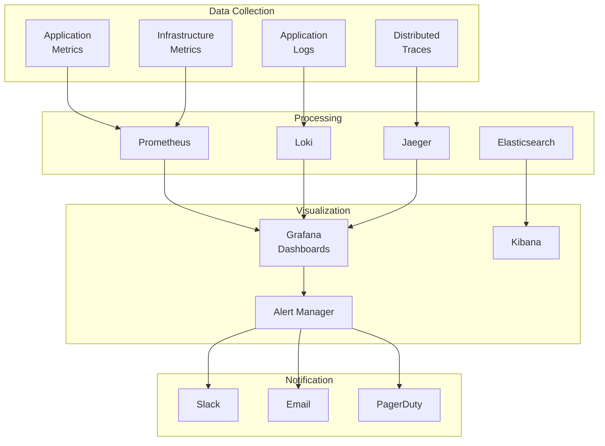

## Performance Architecture

### Load Balancing Strategy

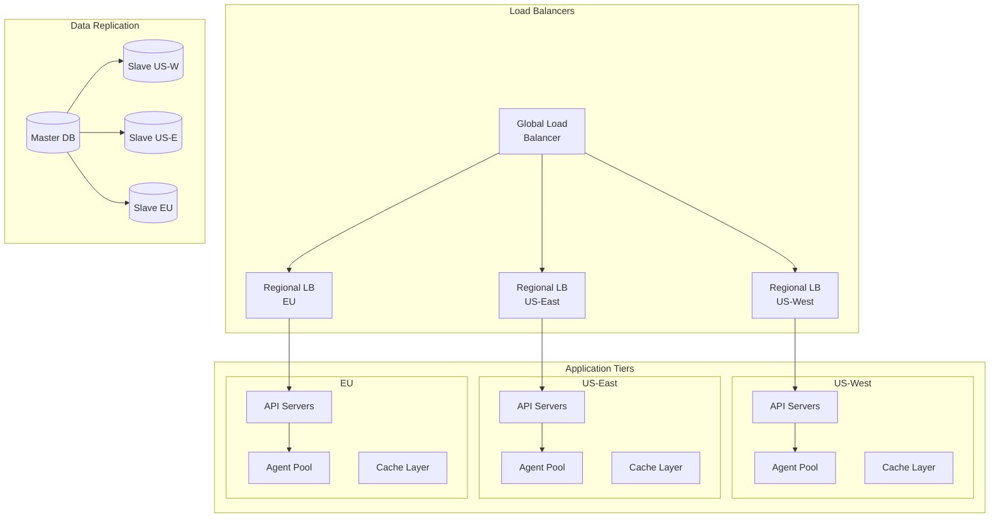

This comprehensive architecture documentation provides detailed insights into the system design, component interactions, and deployment strategies for the HR Matcher system.